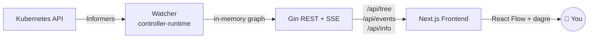

<div align="center">

# Xafrun ☸️

**See your Flux.** A real-time, visual GitOps dashboard for [Flux CD](https://fluxcd.io).

[](https://github.com/omilun/Talos-on-macos/tree/main/gitops/apps/xafrun/ci)
[](https://goreportcard.com/report/github.com/omilun/xafrun)
[](LICENSE)
[](charts/xafrun)

<!-- TODO: replace with a real screenshot once available -->
<!--  -->

</div>

---

Flux CD is a world-class GitOps engine, but its visibility is fragmented across
the CLI and a handful of general-purpose dashboards. **Xafrun** is the
missing visual bridge — an Argo-style resource tree that shows, at a glance,
how your Git sources flow into Kustomizations and HelmReleases, what's
healthy, and what's broken.

## ✨ Features

- 📊 **Visual dependency graph** — `GitRepository → Kustomization → HelmRelease`,
  laid out top-to-bottom by [dagre](https://github.com/dagrejs/dagre) on top of
  [React Flow](https://reactflow.dev).
- ⚡ **Real-time updates over SSE** — driven by Kubernetes informers, no polling.
- 🎯 **Namespace filtering with ancestor walk** — pick `apps`, the source in
  `flux-system` stays visible because it's a parent.
- 📰 **Status ticker** — collapsible bottom bar that pulses red on errors and
  scrolls cluster metadata (K8s / Flux / Talos / Cilium versions) when healthy.
- 🪶 **Lightweight** — a single Go service + a small Next.js pod.
  Read-only RBAC, hardened security context, signed images with SBOMs.

## 🚀 Quick start

### Helm (recommended)

```bash
# OCI-distributed Helm chart (no chart repo needed)
helm install xafrun oci://registry.talos-tart-ha.talos-on-macos.com/charts/xafrun \
  --version 0.1.0 \
  --namespace xafrun --create-namespace
```

> Maintainers can also `helm install` straight from the repo:
> `helm install xafrun ./charts/xafrun --namespace xafrun --create-namespace`

Then port-forward:

```bash
kubectl -n xafrun port-forward svc/xafrun-frontend 3000:80
open http://localhost:3000
```

### Kustomize

```bash
kubectl apply -k github.com/omilun/Xafrun//deploy?ref=v0.1.0
```

### Local development

```bash
git clone https://github.com/omilun/Xafrun.git
cd Xafrun
make run                       # backend :8080, frontend :3000
```

Full installation guide → [docs/getting-started/quick-start.md](docs/getting-started/quick-start.md)

## 🆚 How does it compare?

| Capability                       | Xafrun | `flux` CLI | Weave GitOps OSS | Capacitor | Headlamp |
|----------------------------------|:--------:|:----------:|:----------------:|:---------:|:--------:|
| Visual dependency graph          |    ✅    |     —      |        ✅        |    ✅     |    —     |
| Real-time push (no polling)      |    ✅    |     —      |        —         |    —      |    —     |
| Namespace-scoped filter          |    ✅    |     ✅     |        ✅        |    ✅     |    ✅    |
| Flux-native (only Flux noise)    |    ✅    |     ✅     |        ✅        |    ✅     |    —     |
| Lightweight (single SA, < 200Mi) |    ✅    |     ✅     |        —         |    ✅     |    —     |
| Reconcile / suspend buttons      |    🛣️    |     ✅     |        ✅        |    ✅     |    —     |
| Multi-cluster                    |    🛣️    |     —      |        ✅        |    —      |    ✅    |
| Auth (OIDC)                      |    🛣️    |     —      |        ✅        |    —      |    ✅    |

🛣️ = on the [roadmap](docs/roadmap.md).

## 📐 Architecture



- **Backend:** Go 1.26 service. `controller-runtime` informers feed an
  in-memory graph; every change triggers a rebuild and a broadcast to SSE
  subscribers.
- **Frontend:** Next.js 16 (App Router) + React 19. The `/api/*` routes proxy
  to the backend; the page subscribes to `/api/events` via `EventSource`.

Architecture deep-dive → [Architecture overview](https://github.com/omilun/Xafrun/blob/master/docs/architecture/overview.md)

## 📦 Prerequisites

| Tool                       | Version                       |
|----------------------------|-------------------------------|
| Kubernetes                 | 1.28+                         |
| [Flux CD](https://fluxcd.io) | v2.x                        |
| Go (for local builds)      | 1.26+                         |
| Node.js (for local builds) | 22+                           |

## 🤝 Contributing

We welcome contributions of any size — bug reports, doc fixes, new features.
See [CONTRIBUTING.md](CONTRIBUTING.md) for development setup and guidelines,
and our [Code of Conduct](CODE_OF_CONDUCT.md).

For security issues, please follow the disclosure process in [SECURITY.md](SECURITY.md).

### How CI works (no GitHub Actions)

Xafrun is built and released by an **in-cluster pipeline** running on
[Argo Workflows](https://argoproj.github.io/argo-workflows/) + [Argo Events](https://argoproj.github.io/argo-events/) +
[BuildKit](https://github.com/moby/buildkit), with images pushed to a
[Zot](https://zotregistry.dev/) OCI registry inside the cluster.

The pipeline definitions live in
[`Talos-on-macos/gitops/apps/xafrun/ci/`](https://github.com/omilun/Talos-on-macos/tree/main/gitops/apps/xafrun/ci):

| Trigger | Workflow | What it does |
|---|---|---|
| `push` to `master` | `xafrun-test` → `xafrun-build` → `xafrun-scan` | Lint + tests, multi-arch images, Trivy scan |
| `tag` `v*.*.*` | `xafrun-release` | Tagged images, cosign signing, Helm OCI push |
| Daily 06:00 UTC | `xafrun-nightly-scan` (CronWorkflow) | Trivy CVE re-scan |
| `push` to `master` (docs) | `xafrun-docs` | Build MkDocs site, publish to docs gateway |

## 🛣️ Roadmap

The high-level roadmap is published at [docs/roadmap.md](docs/roadmap.md). Highlights:

- All Flux CRDs (OCIRepository, Bucket, ImagePolicy, Receiver, Alert…)
- Reconcile / suspend / YAML drawer / Git-vs-cluster diff
- OIDC auth + RBAC-filtered graph
- Multi-cluster (Argo-style)
- Reconciliation history (CNPG-backed)

## 📜 License

MIT — see [LICENSE](LICENSE).

---

<div align="center">
Made with ❤️ for the Flux community.
</div>
