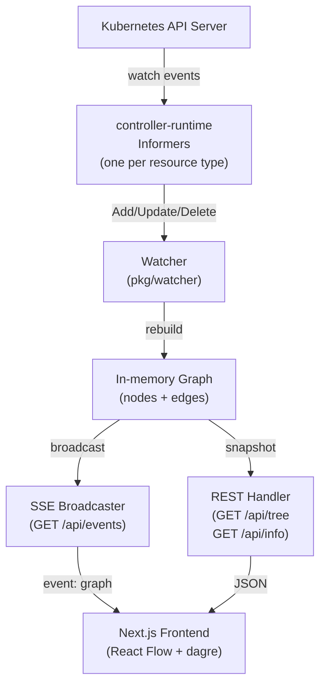

# Architecture Overview

Xafrun is a lightweight two-tier application: a Go backend that watches the Kubernetes API and a Next.js frontend that renders the live graph.

## System diagram

## Component summary

| Component | Role |
|-----------|------|
| **Kubernetes API Server** | Source of truth — emits watch events for Flux CRDs |
| **controller-runtime Informers** | Subscribe to watch events and maintain a local cache |
| **Watcher** | Registers informer handlers; rebuilds the graph on every event |
| **In-memory Graph** | Thread-safe snapshot of all nodes and edges |
| **SSE Broadcaster** | Pushes full graph snapshots to connected browser clients |
| **REST Handler** | Serves on-demand graph snapshots and cluster metadata |
| **Next.js Frontend** | Receives graph via EventSource; renders with React Flow + dagre |

## Key design decisions

- **Full rebuild on every change** — simpler than incremental diffing; the graph is small (tens to low hundreds of nodes in practice) so rebuilding is cheap.
- **SSE over WebSockets** — SSE is unidirectional, trivially proxied by nginx/Cilium Gateway, and natively reconnecting in browsers.
- **No database** — current state only. Historical reconciliation tracking is planned (see [Roadmap](../roadmap.md)).

See the [Backend](backend.md) and [Frontend](frontend.md) pages for detailed explanations.
